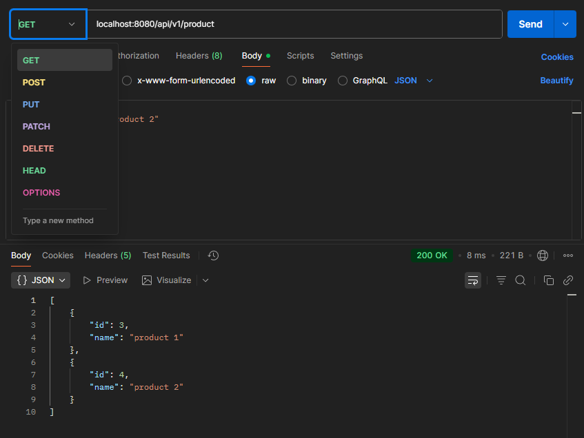
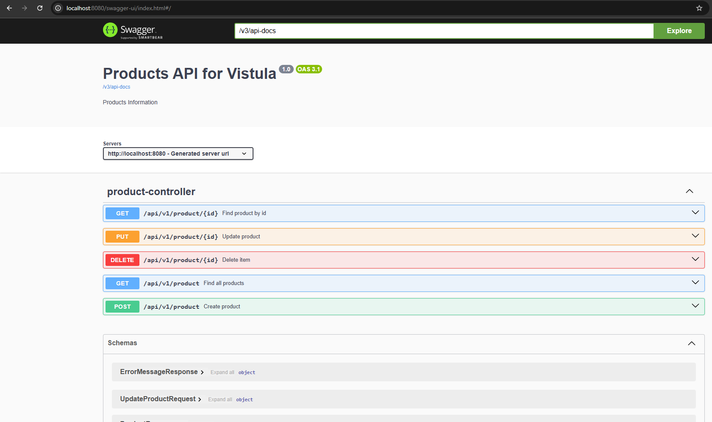
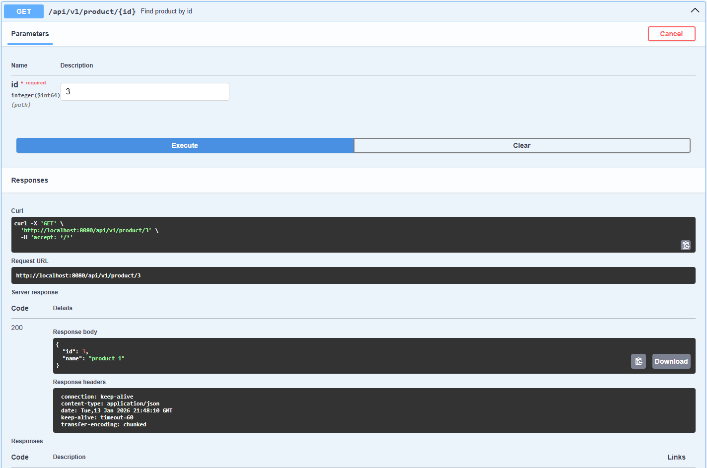
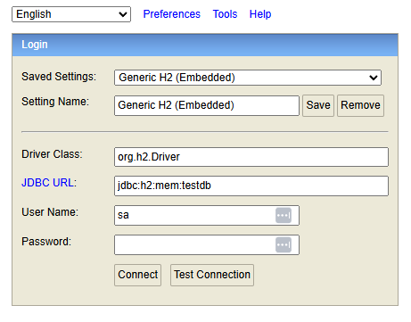
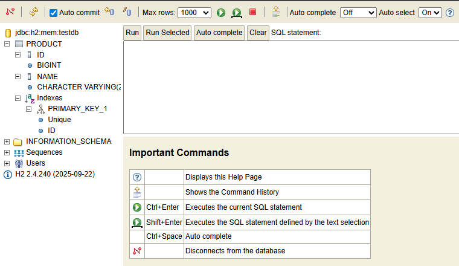

# TASK 2

## Java Spring Boot REST API
This application has 5 endpoints that manage products using **CRUD** operations(create, read, update, delete)

It is intended to be tested using 
- **Swagger**
- **Postman**
- **H2 database**

# How to start
## Using Postman:
1. Run the **SecondSpringBootProjectApplication** file to start the spring boot
2. Open **Postman** and send a **post** request to this url: **localhost:8080/api/v1/product**. This will create a new product in the database.
3. Send a **get** request with this url: **localhost:8080/api/v1/product/1** to see that you have created a product, and it got assigned with an id.
4. Now you can use **post** to create more products, **delete** with an id to remove a product and **put** with an id to update a product that you chose.
5. Finally, you can use **get** without an id in the url to see all the products.

Here is an example:

## Using Swagger UI:
1. Run the spring boot 
2. Open [Swagger](http://localhost:8080/swagger-ui/index.html#/)
3. Here are the 5 controllers that we already tested in **Postman**, just with UI
4. Open any controller and click **TRY IT OUT**, provide required parameters and click execute
5. Observe the responses 

## Using H2 Console
1. Run the spring boot 
2. Open the [H2 Console](http://localhost:8080/console) and connect with this url: **jdbc:h2:mem:testdb**

It should look like this:

3. On the left panel find the **Product**
4. In the SQL editor type **SELECT * FROM PRODUCT;**

This will show you what happens with the products after CRUD controllers
- A new row will appear after **post**
- The name column changes for that id after **put**
- A row disappears after **delete**

This database resets after each restart

